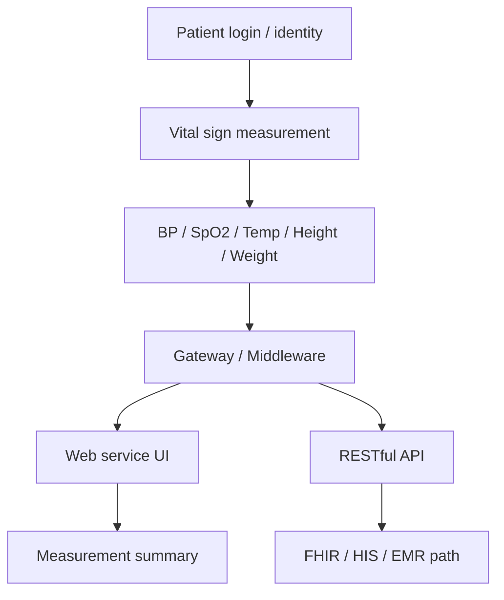
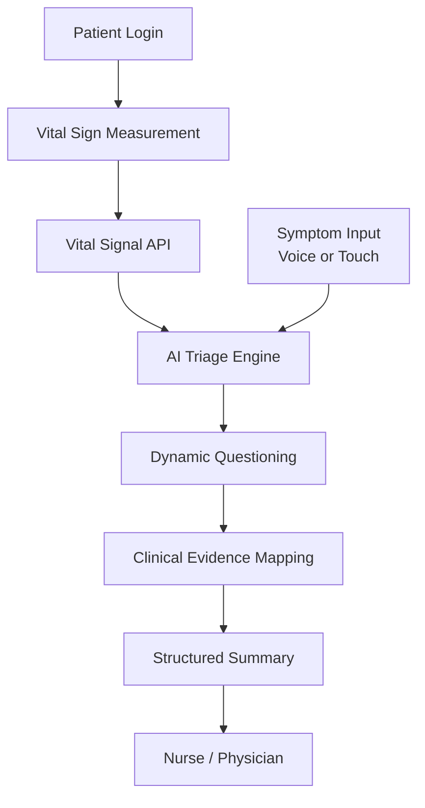
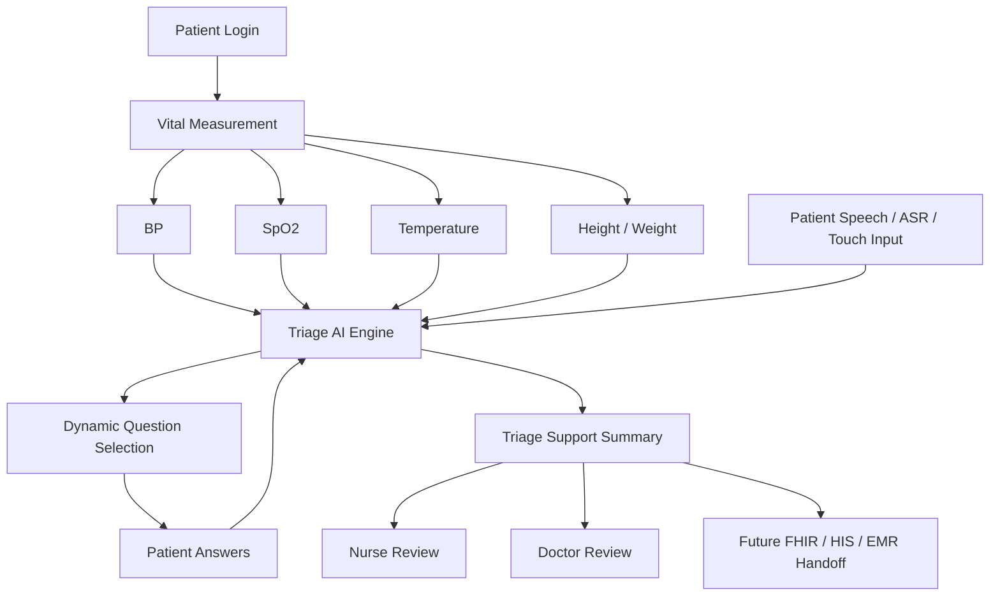

# Architecture Insertion And Clinical Grounding

## Core Correction

The urgent question is not "how do we put AI into the kiosk."

The urgent question is:

> Where is the right insertion point for AI triage inside 慧誠智醫's existing
> vital-sign measurement and hospital-integration workflow?

慧誠智醫 is best treated as a medical device integration and hospital workflow
company:

- kiosk hardware,
- medical device integration,
- middleware / gateway,
- HIS / EMR / FHIR integration,
- deployment,
- hospital integration.

AI is a new capability layer on top of that system. The product question is not
chatbot design. It is AI triage product architecture.

## What We Are Building Toward

The target is **AI-assisted intake + triage workflow**, not diagnosis.

The sellable product story is closer to:

```text
patient arrives
-> vital signs are measured
-> AI asks symptom questions
-> AI dynamically follows up
-> AI produces a structured summary
-> nurse / clinician reviews quickly
```

It is not:

```text
AI tells the patient what disease they have
```

That distinction changes the regulatory, clinical, product, and sales boundary.

## Existing Workflow Hypothesis

慧誠 already has a measurement-centered workflow:



The first design task is to understand this workflow precisely enough to insert
AI without breaking the product.

## Preferred Insertion Point

The most plausible v0 insertion point is **after measurement completes**.

```text
login
-> measure BP / SpO2 / temperature / height / weight
-> AI triage starts with vital context
-> dynamic symptom questioning
-> structured triage-support summary
-> nurse / physician review
-> future HIS / EMR handoff
```

This is safer and more product-aligned than starting with AI before measurement,
because it uses the company's differentiating asset: real measured vital signs.



## Vital-Aware Dynamic Triage

The differentiator is not a generic symptom chatbot. It is:

> vital-aware dynamic questioning

Many symptom checkers only use text. 慧誠 has vital-sign devices. The demo should
show that BP, SpO2, temperature, BMI, and similar measurements can change the
question path and the urgency framing.



Example design intuition:

| Scenario | Vital context | Questioning impact |
| --- | --- | --- |
| Chest pain with normal SpO2, normal BP, stable HR | lower immediate physiologic alarm | ask duration, radiation, exertion, medication, reflux/anxiety-like context, and red flags |
| Chest pain with low SpO2, hypotension, abnormal temperature, or severe distress | higher escalation concern | shorten questioning, alert staff, ask emergency red flags, consider ECG / immediate clinician review path |
| Fever with abnormal vitals | infection / systemic risk concern | ask infectious symptoms, duration, risk factors, dehydration, respiratory or urinary symptoms |
| Urinary symptom with fever or flank pain | possible upper-tract / systemic concern | escalate from simple symptom intake to clinician review path |

These examples are not clinical rules yet. They are product architecture
examples that require source-backed clinical evidence mapping before product
claims.

## Clinical Grounding

The next core work is not coding. It is clinical evidence mapping.

The workflow is:

```text
symptom
-> clinical guideline / authority source
-> triage logic
-> questioning flow
-> escalation criteria
-> structured summary
```

The important product question is:

> Why are we asking this question, and what source supports it?

This becomes a question provenance system.

## FDA Boundary

Do not treat FDA as the source of the symptom questionnaire.

FDA is more likely to matter for:

- intended use,
- software risk,
- validation,
- cybersecurity,
- quality system expectations,
- clinical evidence and safety claims.

The symptom / triage logic will often need to come from specialty and clinical
sources such as:

- AHA / ACC for cardiovascular contexts,
- ACEP / emergency medicine triage sources,
- ESI / Emergency Severity Index materials,
- CDC guidance when relevant,
- AUA / EAU for urology contexts,
- NICE or other jurisdiction-specific clinical guidance,
- hospital / company-provided protocols,
- clinician-approved local workflows.

This repo must not cite exact guideline clauses until the source has been
verified and recorded. The task is to build traceable clinical grounding, not to
invent medical logic.

## Question Provenance Template

Every production-facing question should eventually have metadata like this:

| Field | Meaning |
| --- | --- |
| `question_id` | Stable internal identifier |
| `question_text` | Patient-facing question |
| `symptom_context` | Symptom or branch where the question appears |
| `vital_trigger` | Vital-sign condition that makes the question relevant |
| `source_name` | Guideline / protocol / authority source |
| `source_version` | Year, version, or publication identifier |
| `source_excerpt_or_clause` | Exact support text, after source verification |
| `clinical_purpose` | Why the question is asked |
| `escalation_effect` | How the answer can affect triage support |
| `review_owner` | Clinician / company / academic reviewer |
| `status` | draft, source-verified, clinician-reviewed, demo-only, retired |

Example row shape:

| Question | Trigger | Source | Purpose | Status |
| --- | --- | --- | --- | --- |
| Do you have chest pain radiating to your arm, jaw, back, or shoulder? | chest pain plus cardiovascular concern | source to verify, likely cardiovascular / emergency medicine guideline family | cardiac risk screening | draft, not source-verified |
| Do you feel short of breath? | chest pain, low SpO2, respiratory complaint, or distress | source to verify, likely emergency / respiratory guideline family | respiratory or cardiopulmonary escalation screening | draft, not source-verified |
| Do you have fever with flank pain or urinary symptoms? | urinary symptoms plus temperature elevation | source to verify, likely urology / infectious disease guideline family | identify possible complicated urinary condition requiring review | draft, not source-verified |

## Vital-To-Question Impact Table

The demo needs a simple, source-governed way to show how vital signs influence
question flow.

| Vital signal | Potential impact on question flow | Clinical evidence status |
| --- | --- | --- |
| Low SpO2 | respiratory / cardiopulmonary escalation branch; shorten low-risk questioning | source mapping required |
| High or low BP | cardiovascular risk branch; ask chest pain, neuro symptoms, distress, medication context | source mapping required |
| Fever / abnormal temperature | infection branch; ask duration, source symptoms, systemic warning signs | source mapping required |
| BMI / height / weight | metabolic and risk-context questions, not immediate standalone triage claim | source mapping required |
| Heart rate, if available | urgency context and possible escalation signal | source mapping required |

## MVP Scope Guardrail

Scope explosion risk is high: ASR, multilingual, all-specialty logic, FDA,
FHIR, HIS, dynamic triage, cloud, local CPU, and vital fusion can all expand at
once.

The first version should be deliberately narrow:

- English only,
- urgent-care lite,
- one kiosk workflow,
- CPU-only by default,
- touch input plus optional ASR,
- limited vital-sign set,
- small symptom-category set,
- no diagnosis,
- no autonomous medical decision,
- dynamic questioning,
- vital-aware routing,
- structured summary for clinician review.

## Immediate Work Products

1. Product integration diagram:
   - where AI starts;
   - what data it receives;
   - what it returns;
   - whether it writes anywhere.
2. Question-to-source mapping table:
   - symptom;
   - question;
   - vital trigger;
   - source;
   - purpose;
   - evidence status.
3. Vital-to-routing rule sketch:
   - how BP / SpO2 / temperature / BMI affect follow-up questions;
   - what remains demo-only until verified.
4. API boundary:
   - JSON / RESTful payload hypothesis;
   - mocked vital-sign input for demo;
   - no live HIS / EMR write path for v0.

## Key Product Test

慧誠 is not only testing whether the AI works. They are testing whether the team
has product thinking:

- modularity,
- productization,
- multilingual path,
- go-to-market demo discipline,
- integration awareness,
- incremental development,
- clinical and regulatory defensibility.

The repo should therefore prioritize integration architecture, evidence
traceability, and v0 scope control before UI polish or model expansion.
