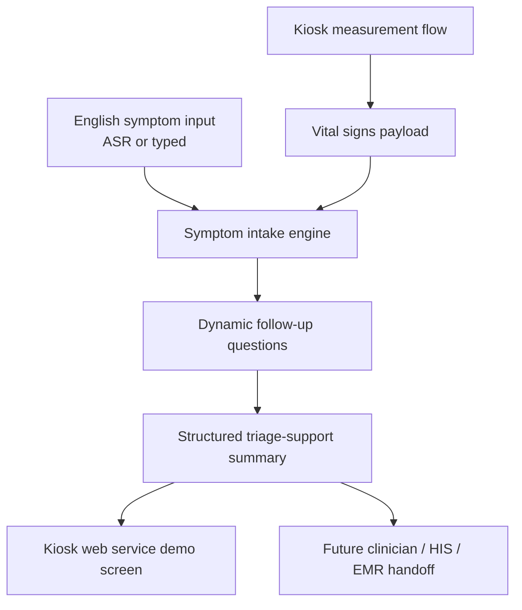

# Project Brief

## One-Line Goal

Create an English AI triage market demo that fits 慧誠智醫's existing kiosk /
web service story before the June US customer visit.

## Current Priority

The current priority is not UI polish, prompt tuning, or model expansion.

The current priority is defining the product insertion point:

```text
vital-sign measurement complete
-> vital-aware AI triage starts
-> dynamic questioning
-> structured triage-support summary
-> nurse / physician review
```

Detailed architecture note:

```text
docs/architecture-insertion-and-clinical-grounding.md
```

Supporting context:

```text
docs/source-index.md
docs/wu-instruction-register.md
workstreams/
```

## What Exists

慧誠智醫 appears to have:

- medical measurement devices for blood pressure, SpO2, temperature, height, and
  weight;
- a Windows-based fanless all-in-one kiosk with no onboard GPU;
- a web service UI for measurement flow and summary report;
- middleware / gateway integration;
- RESTful API, FHIR, HIS, and EMR integration context.

## What They Want

Short term:

- English triage-facing demo;
- visible integration with kiosk / web service flow;
- symptom collection, structured summary, workflow acceleration, and
  vital-sign-aware story;
- customer-facing capability proof before a June US customer visit.

Long term:

- English voice input;
- broad / all-specialty symptom triage;
- vital signs integrated into triage logic;
- a triage AI database / system that can improve across US, Middle East,
  Singapore, Thailand, Malaysia, and other markets.

## Demo Architecture Hypothesis



## Required Decisions Before Implementation

- Is v0 integration a link, iframe, same web app, API handoff, or mocked flow?
- What exact vital-sign payload can the kiosk expose?
- Can the demo use simulated vital signs?
- What minimum symptom flow should be shown?
- Is ASR required for v0, or can typed input stand in for voice?
- Which vital signs affect question routing, and how is each effect justified?
- What clinical source supports each question and escalation path?
- What wording is safe for the output: triage support, recommended care level,
  clinician review prompt, or another phrase?
- Which architecture diagram is safe to share externally?

## Boundary

This repo can prepare a demo, architecture notes, and implementation scaffold.
It must not turn into clinical product claims before clinical criteria,
validation, privacy, cybersecurity, and company approvals exist.
