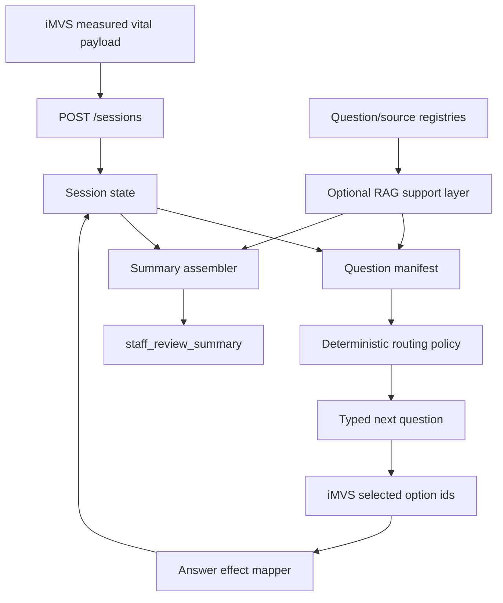

# AI Triage Detailed Project Overview For Expert Review

## 1. Executive Summary

This project is a synthetic-data AI triage kiosk demo built for
慧誠智醫（imedtac Co., Ltd.）and NYCU collaboration. The current product
capability is:

```text
iMVS vital-sign measurement
-> NYCU demo API starts a session with measured vital context
-> NYCU returns short typed questions
-> iMVS submits selected option ids
-> NYCU returns next question or staff_review_summary
-> staff / clinician reviews the summary
```

The demo is scoped as **vital-aware intake support and staff-review summary
generation**. It is not a diagnosis system, treatment advisor, final triage
level engine, production HIS / EMR / FHIR writeback system, or real patient-data
workflow.

The immediate expert-review question is not whether the endpoint contract should
be redesigned. The current endpoint architecture is appropriate for the June
demo and should remain stable. The active design issue is inside the question
engine:

```text
How should patient answers and measured vital context affect the next question
and final staff-review summary in a way that is dynamic, clinically bounded,
auditable, and easy to implement?
```

The current runtime is intentionally simple and mostly linear. That made the
first integration feasible, but imedtac's latest testing feedback shows that
the flow feels too static: different answer choices appear to lead to the same
next question and similar result pages. The next version should keep the same
API endpoints and add a small governed decision layer for answer-sensitive
question routing and answer-sensitive summary generation.

The recommended direction is a **hybrid deterministic + retrieval-supported
architecture**:

```text
stable session API
-> structured answer state
-> deterministic routing policy / question manifest
-> optional RAG for source-backed candidate retrieval and answer normalization
-> bounded staff-review summary generator
-> tests and clinical-review gate
```

RAG can help with question provenance, semantic answer/option matching, and
retrieving candidate question rationale from a controlled registry. RAG should
not autonomously decide clinical urgency, output diagnosis, assign formal triage
level, or generate unreviewed patient-facing questions for the June demo.

## 2. What The Project Enables

The project demonstrates a practical product capability for a kiosk workflow:

- measured vital signs become active context, not passive decoration;
- the kiosk can ask short, renderable, patient-facing questions;
- patient answers can change the next question path inside a bounded case;
- the final output is a structured staff-review summary;
- the API uses stable machine-readable ids instead of parsing display text;
- the workflow remains safe for demo because all clinical interpretation is
  routed to staff review.

The first live-performance lane is the tachycardia / high-heart-rate scenario.
This lane was selected because heart rate can be demonstrated more reliably in a
room than SpO2, and imedtac wants a high-heart-rate story that shows dynamic
interaction.

## 3. Current Demo Boundary

### 3.1 Operating Scope

The current demo owns:

- synthetic-data case flow;
- measured or synthetic demo vital payload;
- typed questions: `single_choice` and `multi_choice`;
- stable `session_key` state;
- stable `option.id` answer submission;
- staff-review summary;
- QR / summary page preview for demo explanation;
- human-review workflow and separate production validation path.

### 3.2 Scope Controls

The demo deliberately avoids:

- diagnosis;
- treatment advice;
- ECG / lab / medication order;
- final triage / formal acuity score;
- department recommendation;
- emergency disposition;
- real patient identifiers;
- production HIS / EMR / FHIR writeback;
- raw audio retention;
- unreviewed LLM-generated patient-facing clinical questions.

The positive operating frame is:

```text
synthetic-data vital-aware intake support
-> controlled question workflow
-> staff_review_summary
-> human review
-> separate validation path before production use
```

## 4. Current API Contract

### 4.1 Frozen June Contract

The June API contract has two main POST endpoints:

```http
POST /api/triage-demo/sessions
POST /api/triage-demo/sessions/{session_key}/answers
```

A read-only QR / summary helper has also been added:

```http
GET /api/triage-demo/sessions/{session_key}/summary
```

The QR helper supports:

```text
/demo-ui/summary-review/?session_key=<session_key>
```

This helper does not replace the two POST endpoints. It only lets a phone or
browser load the completed `staff_review_summary` after the session has reached
`summary_ready`.

### 4.2 Start Session

Endpoint:

```http
POST /api/triage-demo/sessions
```

Current workflow mode:

```text
post_measurement_only
```

Meaning:

```text
iMVS completes vital measurement first
-> iMVS sends measured vital payload to NYCU
-> NYCU creates a session
-> NYCU returns session_key + first typed question
```

Important request fields:

| Field | Role |
| --- | --- |
| `request_id` | Per-request trace id. |
| `idempotency_key` | Safe retry key for same logical operation. |
| `case_id` | Synthetic case id, currently `demo-tachycardia-live-001`. |
| `workflow_mode` | June value: `post_measurement_only`. |
| `measurement_state` | June normal value: `complete`. |
| `vitals_ready` | June value: `true`. |
| `vitals` | Measured / demo vital payload. |
| `capabilities` | UI capabilities such as question types and max options. |

Important response fields:

| Field | Role |
| --- | --- |
| `session_key` | Session handle for later answer calls. |
| `session_expires_at` | Demo TTL; current runtime uses 30 minutes. |
| `status` | `question`, `summary`, or `error`. |
| `session_state` | `active`, `summary_ready`, `expired`, or `error`. |
| `progress.expected_total` | Denominator for `Question X of Y`. |
| `question` | Typed renderable question object. |

### 4.3 Submit Answer

Endpoint:

```http
POST /api/triage-demo/sessions/{session_key}/answers
```

The iMVS UI sends:

```json
{
  "question_id": "tachy-current-feeling",
  "answer": {
    "selected_option_ids": ["heart_racing", "chest_heavy"],
    "scale_value": null
  }
}
```

The API returns either:

```text
status=question -> next question object
status=summary  -> staff_review_summary
status=error    -> stable error / recovery instruction
```

The UI should lock answer controls after submit and only unlock after the API
returns a next question or summary. If the same `idempotency_key` is used with a
changed body, the API returns `idempotency_conflict` and the June recovery is
restart demo session / labeled fallback.

### 4.4 Summary Lookup

Endpoint:

```http
GET /api/triage-demo/sessions/{session_key}/summary
```

Rules:

- only returns summary after `session_state=summary_ready`;
- returns `session_not_summary_ready` if the session is still active;
- returns `session_expired` after the TTL;
- aligns with `session_expires_at`;
- supports QR scanning without putting the full payload in the QR URL.

## 5. Current Runtime Implementation

The core runtime lives in:

```text
api/lib/triage-demo-contract.js
```

Current behavior:

- `questionSequence` is a fixed ordered list of seven tachycardia questions.
- `createSession()` starts a session and returns question 1.
- `submitAnswer()` validates the current question and selected option ids.
- The next question is currently selected by `session.answers.length`, so the
  flow is mostly linear.
- `buildSummaryResponse()` clones a fixed summary example and updates the
  objective section with measured vital payload values.
- Partial vitals are supported: missing or unusable vital fields are not claimed
  as measured facts in the summary.
- Contract tests verify bearer token behavior, idempotency conflict,
  partial-vitals behavior, option-count/label limits, and summary lookup.

This is a strong first rehearsal implementation because it is stable and easy to
connect. It is not yet a strong dynamic triage-support demonstration because
the next-question path and final summary do not respond enough to answer
variation.

## 6. Current Question Set

The active tachycardia lane uses seven visible patient-facing questions:

| # | API question id | Purpose |
| --- | --- | --- |
| 1 | `tachy-chief-concern` | Anchors high-heart-rate / palpitation / chest-tightness concern. |
| 2 | `tachy-onset` | Captures onset / duration. |
| 3 | `tachy-current-feeling` | Captures current descriptors such as heart racing, chest tightness, pressure/pain. |
| 4 | `tachy-associated-symptoms` | Screens for shortness of breath, sweating/nausea/fatigue, dizziness/fainting, none. |
| 5 | `tachy-post-vital-heart-rate-cue` | Connects measured high-heart-rate cue to current state. |
| 6 | `tachy-heart-history-meds` | Captures rhythm-history / heart-BP medicine context. |
| 7 | `tachy-medication-allergy-confirm` | Captures allergy / medication confirmation context. |

Machine-readable option IDs are the contract. Display labels may be shortened
for human factors, but `option.id` should remain stable unless a versioned
change request is recorded.

## 7. Human-Factor / UI Constraints

imedtac has provided concrete UI guidance:

| Constraint | Current contract |
| --- | --- |
| Layout | `3 x 3` grid |
| Option count | `2-9` options |
| Multi-choice option label | about `26` total characters |
| Single-choice option label | about `60` total characters |
| Generic skip | not used for June |
| Not sure | represented by explicit option IDs |
| None of these | returned as an ordinary option when clinically needed |

The API should return short labels and stable IDs. Longer clinical rationale
belongs in metadata, registry records, review notes, and staff summary, not in
patient-facing option labels.

## 8. Latest imedtac Feedback And Active Problem

imedtac reports that their flow is connected and has been moved onto their
formal machine for testing. Their internal test and formal machines both
connect to the same NYCU test/demo environment. Johnny accepted this
one-environment strategy for the demo.

The demo story remains:

```text
high-heart-rate / tachycardia scenario
```

Johnny's latest testing feedback:

- the flow feels too static;
- different answer choices appear to lead to the same next question;
- different answer choices appear to lead to the same result page;
- result-page values need to match the current measured session values;
- the demo should show dynamic interaction inside the bounded high-heart-rate
  scenario;
- `2026-06-10` was discussed but not confirmed;
- the working latest first version target is before `2026-06-15`;
- gradual iteration is acceptable if imedtac is notified before deployment.

This feedback creates a clear next SDD requirement:

```text
The tachycardia demo must show answer-sensitive next-question routing and/or
answer-sensitive staff-review summary variation, while preserving stable API
endpoints and the staff-review-only boundary.
```

## 9. Why The API Architecture Should Stay Stable

The endpoint contract should not be redesigned for the current problem.

Reasons:

1. The two POST endpoints already support dynamic logic. The answer payload
   contains `question_id` and `selected_option_ids`, which is enough state for a
   routing engine.
2. The `session_key` already supports multi-turn state.
3. The `staff_review_summary` shape can already vary by answer path.
4. The QR summary helper already solves the phone / QR display problem.
5. Endpoint path and schema stability have already been communicated to imedtac.
6. A new endpoint architecture would increase integration risk before the June
   first-version target.

The needed change is internal:

```text
current linear sequence
-> governed question routing policy
-> answer-derived summary generator
-> tests proving two different answer paths produce visible differences
```

## 10. Proposed SDD Update: Dynamic Question Engine

### 10.1 Design Goal

The dynamic engine should make the demo visibly responsive without becoming an
autonomous clinical decision system.

Target behavior:

```text
same HR 130 context
answer path A: palpitations + no associated symptoms
-> follow-up emphasizes heart-rate cue, rhythm/medication context, staff review
-> summary notes no selected warning symptoms

answer path B: chest pressure + shortness of breath + dizziness
-> follow-up emphasizes cardiopulmonary warning-symptom review
-> summary highlights selected warning-symptom context for staff review
```

Both paths remain staff-review intake support. Neither path outputs diagnosis,
treatment, formal acuity, or department recommendation.

### 10.2 Recommended Runtime State Model

Each session should maintain:

```js
{
  session_key,
  session_expires_at,
  state,
  vitals,
  patient_context,
  answers: [
    {
      question_id,
      selected_option_ids,
      option_effects,
      timestamp,
      idempotency_key
    }
  ],
  derived_flags: {
    elevated_heart_rate_demo: true,
    reported_palpitations: true,
    reported_chest_tightness: false,
    selected_short_breath: false,
    selected_dizzy_faint: false,
    selected_none_associated: true,
    medication_context_needs_confirmation: true
  },
  routing_trace: [
    {
      from_question_id,
      selected_option_ids,
      candidate_question_ids,
      selected_next_question_id,
      reason_codes
    }
  ]
}
```

### 10.3 Question Manifest

The next hardening step is to move from a plain `questionSequence` array to a
versioned question manifest:

```js
{
  id: "tachy-associated-symptoms",
  registry_refs: ["TACHY-004"],
  source_refs: [
    "AHA-TACHYCARDIA-FAST-HR",
    "AHA-HEART-ATTACK",
    "MEDLINEPLUS-AFIB",
    "DUOBAO-AFRVR-TACHY-QA-20260525"
  ],
  evidence_status: "source-backed",
  review_owner: "clinical_reviewer_tbd",
  type: "multi_choice",
  text: "Are any of these happening with it?",
  options: [
    {
      id: "short_breath",
      label: "Shortness of breath",
      effects: ["associated_short_breath"]
    },
    {
      id: "dizzy_faint",
      label: "Dizzy or fainting",
      effects: ["associated_dizzy_faint"]
    },
    {
      id: "none_of_these",
      label: "None of these",
      effects: ["associated_symptoms_none_selected"],
      mutually_exclusive: true
    }
  ],
  next_policy: {
    default_next: "tachy-post-vital-heart-rate-cue",
    branches: [
      {
        if_any_effect: ["associated_short_breath", "associated_dizzy_faint"],
        next: "tachy-warning-symptom-review",
        reason_codes: ["associated_warning_symptom_selected"]
      }
    ]
  },
  summary_templates: {
    subjective_effects: {
      associated_short_breath: "Patient selected shortness of breath with the high-heart-rate context.",
      associated_dizzy_faint: "Patient selected dizziness or fainting context for staff review.",
      associated_symptoms_none_selected: "Patient selected none of the listed associated warning symptoms."
    }
  }
}
```

The manifest can be generated from or checked against:

- `data/question_registry.csv`;
- `data/api_question_mapping.csv`;
- `data/source_registry.csv`.

### 10.4 Routing Policy

Use a simple deterministic policy first:

```text
1. Read current session vitals.
2. Read selected option ids.
3. Map option ids to semantic effects.
4. Update derived_flags.
5. Evaluate branch rules in priority order.
6. Return the next question.
7. Record routing_trace for audit and expert review.
```

Example branch priority:

| Priority | Condition | Next behavior |
| --- | --- | --- |
| P0 | invalid session / expired session | return stable error |
| P1 | selected concerning associated symptoms | ask warning-symptom or staff-confirmation follow-up |
| P2 | chest pressure/pain selected | ask chest-detail / current-state follow-up |
| P3 | no associated symptoms selected | proceed to heart-rate cue and history/medication context |
| P4 | not sure / staff confirm selected | route to staff-confirmation wording |
| P5 | no special branch | proceed through default tachycardia lane |

The router should not compute formal clinical acuity. It should only select the
next controlled question and reason codes for staff review.

### 10.5 Summary Generator

The summary generator should stop cloning a fixed summary except for structure.
It should assemble sections from session state:

```text
subjective = selected answer effects + patient context
objective = measured vital values actually present in session
review_basis = measured vital cue + selected answer families
review_action = staff-review confirmation tasks
handoff_reason_codes = stable reason codes from vitals + answers
scope_controls = fixed demo boundary
```

Required consistency rule:

```text
If a value or symptom is not in this session's vitals / selected answer ids,
do not state it as a measured or selected fact in the summary.
```

## 11. RAG Evaluation

### 11.1 Short Recommendation

RAG can be useful, but it should be used as a **support layer**, not the primary
runtime decision-maker for the June demo.

Recommended use:

```text
RAG for provenance, semantic matching, candidate retrieval, and explanation
support
deterministic manifest/rules for runtime question routing and safety boundary
```

### 11.2 Where RAG Fits Well

RAG is useful for:

1. **Question provenance retrieval**
   - Given a symptom/vital context, retrieve relevant rows from
     `question_registry.csv` and `source_registry.csv`.
   - Show why a question exists and what source family supports it.

2. **Answer-to-option semantic matching**
   - If future voice / free-text input is allowed, compare patient speech
     transcript to existing option labels and synonyms.
   - Return a ranked list of candidate option IDs with confidence.
   - Require user/staff confirmation before submitting the selected option ID.

3. **Candidate next-question recommendation**
   - Retrieve candidate questions for a context such as:
     `HR 130 + palpitations + chest tightness + shortness of breath`.
   - The router can then select among reviewed candidates based on deterministic
     policy and priority.

4. **Expert review and authoring**
   - Help clinical reviewers find source-backed question candidates.
   - Help maintain the question bank and explain coverage gaps.

5. **Summary wording support**
   - Retrieve approved phrase templates for selected reason codes.
   - Keep summary generation grounded in reviewed text snippets rather than
     free generation.

### 11.3 Where RAG Should Not Be Used Directly

RAG should not directly:

- assign final triage level;
- diagnose a disease;
- recommend treatment or orders;
- generate new patient-facing clinical questions at runtime without review;
- decide emergency escalation without a reviewed rule/owner;
- silently map ambiguous free text into an answer ID without confirmation;
- use private transcripts or raw source notes as live medical evidence.

### 11.4 Current Choice-Based UI Means RAG Is Not Required For June

The current iMVS UI sends `selected_option_ids`. If the user taps a button, the
answer is already structured:

```json
{
  "selected_option_ids": ["short_breath", "dizzy_faint"]
}
```

For this mode, RAG is not needed to interpret the answer. The correct next step
is to map option IDs to effects and use deterministic routing.

RAG becomes more valuable when:

- voice input returns a transcript;
- free text is allowed;
- the system needs to suggest a question from a large reviewed bank;
- the expert wants source-backed rationale for each branch;
- the question bank grows beyond one or two demo cases.

### 11.5 Suggested RAG Architecture

Use a controlled knowledge base with three index families:

| Index | Content | Runtime use |
| --- | --- | --- |
| `question_index` | reviewed question rows, option IDs, effects, source refs, review status | Retrieve candidate questions and option semantics. |
| `source_index` | approved source summaries and source metadata | Retrieve provenance / rationale; not raw unbounded text. |
| `phrase_template_index` | approved summary phrase templates keyed by reason codes | Assemble bounded staff-review summaries. |

Do not index credentials, raw private transcripts, raw chat logs, or unreviewed
clinical claims for runtime use.

### 11.6 Answer / Option Matching With RAG

For future voice or free-text:

```text
ASR transcript
-> normalize text
-> retrieve candidate option IDs from current question's option set only
-> score semantic match
-> if confidence high, show selected option for user/staff confirmation
-> if ambiguous, show "Not sure / ask staff" or ask clarification
-> submit only stable option IDs to API
```

Important control:

```text
The matching space must be limited to the current question's allowed options.
```

This avoids a model matching a patient's answer to an option that is not valid
for the current question.

Example:

```text
Current question: Are any of these happening with it?
Allowed option IDs:
- short_breath
- sweating_nausea_fatigue
- dizzy_faint
- none_of_these

Transcript: "I feel lightheaded and almost fainted."
RAG / semantic matcher candidate:
- dizzy_faint, confidence high

UI action:
- highlight "Dizzy or fainting"
- require confirmation
```

### 11.7 Next-Question Generation With RAG

For June, do not let RAG generate the next question freely. Use RAG to retrieve
candidate reviewed questions, then use deterministic selection:

```text
derived_flags
-> retrieve candidate question rows with matching trigger_symptom / trigger_vital
-> filter: demo_allowed=yes_demo_only or approved
-> filter: question type supported by iMVS
-> filter: option count / label length within UI constraints
-> deterministic priority rules select next question
-> record routing_trace
```

This gives the appearance and product value of dynamic questioning without
letting the model invent clinical logic during the demo.

## 12. Proposed Technical Architecture

### 12.1 Current Architecture

```mermaid
flowchart TD
  A[iMVS completes vital measurement] --> B[POST /sessions]
  B --> C[NYCU in-memory session store]
  C --> D[Fixed questionSequence]
  D --> E[iMVS renders typed question]
  E --> F[POST /sessions/{session_key}/answers]
  F --> G[Next fixed question or summary]
  G --> H[Summary review page / staff display]
```

### 12.2 Recommended Next Architecture



### 12.3 Separation Of Responsibilities

| Layer | Owner | Role |
| --- | --- | --- |
| iMVS UI | imedtac | Render question objects, collect selected option IDs, display progress and summary. |
| Session API | NYCU | Stable endpoints, session key, idempotency, CORS/auth, summary lookup. |
| Question manifest | NYCU + clinical reviewer | Reviewed question objects, option IDs, effects, source refs. |
| Routing policy | NYCU + clinical reviewer | Deterministic next-question selection inside bounded demo scope. |
| RAG support layer | NYCU | Retrieve candidate questions, sources, phrase templates; support authoring and future free-text mapping. |
| Clinical review | 多寶 / 許醫師 / company clinical owner | Approve wording, safe branch effects, scope controls. |
| Governance | NYCU + imedtac | Versioning, change control, deployment notice, production validation path. |

## 13. Implementation Roadmap

### Phase 0: Preserve The Contract

- Keep the three endpoint paths unchanged.
- Keep `post_measurement_only`.
- Keep current auth and CORS behavior unless imedtac provides a new formal
  Origin value.
- Keep `staff_review_summary` as staff-only.

### Phase 1: Add Deterministic Dynamic Behavior

Implement:

- option effect mapping;
- derived flags;
- branch policy;
- answer-sensitive summary text;
- routing trace;
- tests for two different answer paths.

Minimal target:

```text
Path A: palpitations + none associated symptoms
Path B: chest pressure + shortness of breath / dizzy

Expected:
- at least one next question differs, or phase_reason differs in a meaningful
  way;
- final staff_review_summary differs;
- objective vital values match the current session;
- no diagnosis / treatment / formal triage output.
```

### Phase 2: Manifest And Registry Hardening

Move question data out of hand-built code into a manifest:

```text
data/question_registry.csv
-> build/check question manifest
-> runtime uses manifest
-> tests fail if question lacks registry/source coverage
```

Add validation:

- option count `2-9`;
- option label length;
- valid `none_option_id`;
- `option.id` uniqueness;
- source refs exist in `source_registry.csv`;
- review status is compatible with demo use.

### Phase 3: Optional RAG Support

Add RAG only after deterministic routing is stable.

Start with offline / internal use:

- retrieve source-backed candidate questions for expert review;
- retrieve phrase templates by reason code;
- compare draft questions against registry coverage.

Then add runtime support only for safe bounded tasks:

- future free-text / ASR answer matching to current question options;
- candidate question retrieval from approved manifest;
- never direct diagnosis or autonomous triage.

### Phase 4: Production-Path Planning

For any future production move:

- persistent session store, not in-memory only;
- PHI / privacy governance;
- audit logs;
- security review;
- real clinical validation;
- model/policy change control;
- imedtac HIS / EMR / FHIR integration design;
- clinical owner approval for thresholds and wording.

## 14. Tests And Acceptance Criteria

### 14.1 Current Tests

Current tests already cover:

- bearer token gate;
- session start;
- option-count / label-length contract;
- idempotency conflict;
- summary readiness;
- partial vitals;
- invalid session errors.

### 14.2 Needed Tests

Add tests:

1. **Dynamic path variation**
   - Same vitals, different selected option IDs.
   - Expect different next question, `phase_reason`, `handoff_reason_codes`, or
     summary text.

2. **Summary session consistency**
   - Start with custom HR / SpO2 / BP values.
   - Complete answers.
   - Assert summary objective uses those exact values and does not include stale
     fixture values.

3. **Answer-derived summary**
   - Select `none_of_these`.
   - Assert summary says no listed associated symptoms were selected.
   - Select `short_breath`.
   - Assert summary includes shortness of breath context.

4. **No forbidden output**
   - Assert summary does not contain diagnosis labels such as `AfRVR`, formal
     triage level, treatment, ECG order, or department recommendation.

5. **Routing trace**
   - Assert returned metadata or internal test hook records why a branch was
     selected.

6. **RAG guardrails if implemented**
   - Retrieved option candidates must be limited to current question options.
   - Low-confidence free-text mappings must return confirmation / not-sure path.
   - Runtime cannot select questions outside reviewed demo manifest.

## 15. Data / Knowledge Assets

Current assets:

| Asset | Role |
| --- | --- |
| `data/question_registry.csv` | Question provenance, source IDs, clinical purpose, output effect, review owner. |
| `data/api_question_mapping.csv` | Runtime question IDs mapped to registry/source refs. |
| `data/source_registry.csv` | Source list and allowed-use limits. |
| `demo/fixtures/tachycardia-live-demo.json` | Current tachycardia fixture. |
| `handoff/api-examples/` | Request/response examples for integration. |
| `api/lib/triage-demo-contract.js` | Runtime contract and question flow. |
| `tests/contract/triage-demo-api.test.js` | Contract behavior tests. |

Recommended new assets:

| Asset | Role |
| --- | --- |
| `data/question_manifest.tachycardia.v0.3.json` | Runtime-ready reviewed question manifest. |
| `data/answer_effects.tachycardia.v0.3.json` | Option ID to semantic effect / reason code mapping. |
| `data/routing_policy.tachycardia.v0.3.json` | Deterministic branch policy. |
| `data/summary_templates.tachycardia.v0.3.json` | Approved summary phrase templates by reason code. |
| `tests/contract/tachycardia-dynamic-path.test.js` | Two-path dynamic behavior test. |

## 16. Expert Review Questions

### 16.1 Clinical / Workflow Questions

1. Inside a high-heart-rate demo, which answer differences are clinically
   meaningful enough to change the next question?
2. Which answer combinations should only change staff-review wording instead
   of changing the next question?
3. Which phrases are safe for patient-facing questions?
4. Which phrases are safe for staff-review summary?
5. Which words must be avoided because they sound like diagnosis, treatment,
   or formal triage?
6. How should "not sure", "none of these", and missing vital signs affect the
   summary?
7. Is a warning-symptom branch useful in the demo, or should all variation stay
   inside summary wording?

### 16.2 Engineering / AI Architecture Questions

1. Is the proposed deterministic routing policy sufficient for the June demo?
2. Should the runtime return `routing_trace` to imedtac, keep it internal, or
   expose it only in debug mode?
3. Should answer-derived flags be persisted as session state or recomputed from
   answers each time?
4. Should the question manifest be JSON generated from CSV registries, or should
   the registries themselves become the runtime source?
5. What is the minimal RAG implementation that helps expert review without
   increasing runtime risk?
6. If free-text / ASR returns later, what confidence threshold and confirmation
   UX should be required before mapping text to option IDs?
7. Which data store should replace in-memory sessions if QR summary links need
   restart tolerance?

### 16.3 RAG-Specific Questions

1. Should RAG be used only offline for authoring/review, or also in runtime?
2. Is it acceptable to use embeddings over reviewed question/option rows for
   answer matching?
3. Should clinical source text be indexed directly, or should we index only
   curated source summaries and registry rows?
4. How should retrieved evidence be shown to reviewers?
5. How should model retrieval failures be represented in the API?
6. Can RAG safely support "next best question" recommendation if deterministic
   policy makes the final selection?

## 17. Recommended Answer To The Current Problem

The current problem can be solved without changing API endpoints.

Recommended solution:

```text
Keep the current API contract.
Add a versioned question manifest.
Map each option id to semantic effects and reason codes.
Use deterministic branch rules for next-question selection.
Assemble staff_review_summary from current session vitals and selected answers.
Use RAG only as a support layer for retrieval, answer normalization, and
question/source authoring.
Add tests that prove two answer paths produce visible differences while staying
inside staff-review scope.
```

This solution gives imedtac the visible dynamic interaction they need for the
demo while keeping the clinical and integration boundary clear.

## 18. Immediate Next Actions

| Priority | Action | Owner | Target |
| --- | --- | --- | --- |
| P0 | Confirm with imedtac that first version before `2026-06-15` is the working target unless an earlier rehearsal is fixed. | Jason | immediate |
| P0 | Implement answer-effect mapping for tachycardia options. | NYCU | before first version |
| P0 | Implement at least one branch or answer-sensitive summary difference. | NYCU | before first version |
| P0 | Add tests for two answer paths and summary consistency. | NYCU | before first version |
| P0 | Notify imedtac before deploying the updated Render version. | Jason | every release |
| P1 | Ask 多寶 / 許醫師 to review which branches are clinically meaningful and safe. | Jason + 多寶 | before wording freeze |
| P1 | Create a small two-path rehearsal packet for imedtac. | NYCU | before imedtac review |
| P2 | Prototype RAG as offline question/source retrieval, not live autonomous routing. | NYCU | after deterministic branch passes |
| P2 | Decide whether RAG answer matching is needed only if voice/free-text returns. | NYCU + expert | future |

## 19. Source Locator

Key canonical files for the expert:

| File | Purpose |
| --- | --- |
| `docs/architecture-insertion-and-clinical-grounding.md` | Product architecture and clinical grounding frame. |
| `handoff/2026-05-21-imedtac-two-endpoint-api-reply.md` | Current external API contract. |
| `handoff/2026-05-25-imedtac-integration-next-steps.md` | Integration freeze, external commitments, QR summary helper. |
| `docs/2026-06-05-question-design-and-screening-scope-response-plan.md` | Latest imedtac feedback and response plan. |
| `decisions/2026-05-22-api-contract-freeze-and-change-control.md` | Change-control rules for external commitments. |
| `data/question_registry.csv` | Question provenance and review status. |
| `data/api_question_mapping.csv` | Runtime question ID mapping. |
| `data/source_registry.csv` | Source registry and allowed-use boundaries. |
| `api/lib/triage-demo-contract.js` | Current runtime implementation. |
| `tests/contract/triage-demo-api.test.js` | Current contract tests. |

## 20. Bottom Line

The project is at a useful turning point. The API has reached enough stability
for imedtac integration, and the next expert task is to strengthen the internal
question engine. The highest-value expert contribution is to define a small,
safe, clinically meaningful routing policy for the tachycardia demo and to
decide how RAG should support, but not replace, that governed routing policy.
