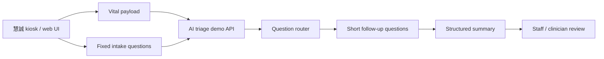

# June Demo Case And Integration Plan

## First Principle

- Scarce resource: execution bandwidth before the June customer demo.
- Canonical source: `source/2026-05-15-imedtac-second-sync-and-duobao-followup/`.
- Near-term output: a believable, synthetic, urgent-care intake demo.
- Boundary: clinician-review summary only; no diagnosis, treatment, test order,
  final triage level, or live patient deployment claim.

## Current Decision

The v0 demo should be:

```text
vital-sign kiosk context
  -> short guided intake
  -> vital-aware follow-up
  -> structured summary for staff
```

It should not be:

```text
all-specialty autonomous AI triage
  -> diagnosis
  -> treatment / order suggestion
  -> production EMR writeback
```

## Company Minutes Update

Johnny Fang's company-side minutes after the meeting are preserved at:

- `source/2026-05-15-imedtac-second-sync-and-duobao-followup/company-provided-meeting-minutes.md`

They confirm the June urgent-care demo frame, `3-5` cases, touch plus partial
voice input, an earlier `8-10` question-budget reference, and doctor-facing
chief-complaint summary. Current June design decision follows the later 慧誠 /
iMVS product-spec requirement: fewer than `8` visible patient-facing questions
per completed case flow.

They also create three items to confirm before implementation:

- `AI 資料訓練 study` should mean synthetic demo / model-feasibility study unless
  real data governance is separately approved.
- `比較完整的解讀結果` should be constrained to a clinician-review summary, not
  diagnosis, treatment, or final triage level.
- Case examples should be reconciled: 慧誠 listed trauma / chronic disease /
  allergy, while our clinical follow-up favored fever/respiratory,
  abdominal-pain/fever, tachycardia/chest tightness, and low SpO2.

## 2026-05-19 Product Spec / API Update

Johnny Fang sent a follow-up email and linked product specification:

- `source/2026-05-19-johnny-ai-triage-product-spec/`
- `docs/2026-05-19-ai-triage-product-spec-api-analysis.md`

The standalone PDF later found in Downloads,
`iMVS AI Triage 智慧檢傷分流系統_20260515.pdf`, is byte-identical to the archived
product-spec PDF. Treat this as confirmation of the same `V 1.0` spec, not a
separate new source version.

The update confirms that the company is now designing the technical
architecture, while the UI is still being planned. The June target remains a
customer demo. The email explicitly says that some future-state items, including
AI summary return into the HIS workflow, are not planned for this demo. Voice
input is also conditional on NYCU/Jason-side progress and should not be treated
as required for the first live demo.

The new hard requirement is an API contract for the demo loop:

```text
iMVS vital-sign payload
  -> NYCU typed question object + session key
  -> iMVS answer payload + session key
  -> NYCU next question or demo staff-summary result
```

Product-spec implications for the current runtime:

- AC06-AC10 align well with the current choice-first v0: dynamic OPQRST-style
  questions, progress display, single-choice, and multi-choice interaction.
  Current June calibration follows the 慧誠 / iMVS product-spec requirement:
  fewer than `8` visible patient-facing questions per completed case flow, with
  the first respiratory flow preferably staying around `5-7`.
- AC11 adds a pain/severity scale widget requirement that should be audited or
  added before the June demo if a pain case is shown.
- AC12 voice input should stay out of v0 unless separately approved, because it
  introduces audio, transcript-confirmation, noise-failover, privacy, and
  runtime reliability questions.
- AC14 supports a demo doctor-result page; implement as a staff-review summary,
  not as diagnosis.
- US15/US16 are future-state / reviewer-facing targets for SOAP, evidence
  mapping, and HIS display. For June, show the shape of the output only; do not
  implement real HIS/FHIR writeback.

Cut rule:

- Build the API/session contract and mock iMVS adapter before expanding cases.
- Use `summary`, `review_basis`, or `staff_review_summary` in payloads.
  Do not name the final field `diagnosis`.
- Use the `2026-05-12` iMVS API `V1.4` field/unit baseline as the adapter
  starting point, then ask 慧誠 for one current synthetic/de-identified payload
  example, any field-name deltas, UI insertion point, and who will join the
  technical sync.

## 2026-05-19 LINE Thursday Engineering Sync Update

Johnny followed up in the `慧誠智醫*智德萬` LINE group after sending the product
spec:

- engineers need an API design document;
- he asked when it can be provided;
- he asked whether Thursday is available for a quick progress sync;
- he will bring the engineering design team to discuss details;
- Jason added 許桓瑜（多寶） to the group.

Source:

- `source/2026-05-19-johnny-line-thursday-engineering-sync/source.md`
- `source/2026-05-19-duobao-line-thursday-engineering-sync/source.md`
- `source/2026-05-19-johnny-direct-line-thursday-engineering-sync/source.md`

Preparation:

- `handoff/2026-05-21-imedtac-engineering-sync-prep.md`
- `handoff/2026-05-21-imvs-nycu-api-design-v0.1.md`
- `handoff/2026-05-21-decision-defaults-and-owner-matrix.md`
- `docs/2026-05-19-two-phase-question-flow-design.md`
- `docs/2026-05-19-api-session-design-plain-explanation.md`
- `handoff/api-examples/`

Meeting implication:

- The LINE times are PM / afternoon. The Thursday sync was finalized for
  `2026-05-21 10:00` Asia/Taipei on Microsoft Teams. The meeting access details
  are preserved local-only in the LINE source.
- Thursday should freeze the API/session contract, not reopen broad product
  scope.
- 多寶's role should be clinical stop rule and safe wording, not product-owner
  responsibility for the whole triage system.
- Jason should prepare a one-page API design doc, one synthetic vital payload,
  one staff-review summary sample, and a decision checklist.
- Johnny clarified that the spec's triage standards and presentation logic were
  first discussed with AI and are adjustable. Treat those standards as draft
  input for clinical review, not locked protocol.

Current API design v0.1 now contains:

- two endpoints: start session and submit answer;
- field table for `session_key`, `progress`, typed questions, answer payload,
  and `staff_review_summary`;
- respiratory synthetic case request/response JSON examples;
- failure behavior and fallback wording;
- privacy and no-real-identifier rule;
- recommended delivery timeline: `2026-05-20` skeleton, `2026-05-21` sync,
  `2026-05-22` v0.2, `2026-05-25` first mock adapter.

Current owner-matrix prep now contains:

- recommended default decisions for `session_key`, output naming, voice, HIS
  writeback, first case, evidence refs, versioning, fallback, and done
  definition;
- must-close questions for Johnny, engineering, and 多寶;
- owner/date matrix: 慧誠 provides payload/UI/engineering owner, Jason provides
  API v0.2, 多寶 provides clinical wording review.

Plain-language implication:

- The session API turns the demo from a standalone URL into a connectable
  workflow contract.
- The first programming obligation is not a full AI product. It is a small mock
  API server, session state, deterministic question router, summary generator,
  validation, and fallback behavior for one synthetic respiratory case.

Post-`2026-05-21` case-selection update:

- imedtac's customer-demo preference now points to tachycardia / palpitation /
  chest tightness as the first live-performance lane because heart rate can be
  demonstrated more reliably than SpO2.
- The first-lane question packet is
  `handoff/2026-05-21-duobao-style-tachycardia-live-demo-question-set.md`.
- The system design remains the same two-endpoint post-measurement loop; the
  case change is implemented through `flow_version`, `case_id`,
  `question_set_version`, registry rows, and staff-summary reason codes.

## 2026-05-27 UI Option Human-Factor Update

Source and decision:

- `source/2026-05-27-imedtac-teams-ui-option-human-factor/source.md`
- `decisions/2026-05-27-imedtac-ui-option-content-contract.md`

Johnny Fang shared imedtac's current option-rendering guidance in Teams and
Jason replied that NYCU would adjust generated content according to the
human-factor guidance. This makes option count and label length part of the
current implementation contract for the June demo.

Active UI-content contract:

| Field | Current contract |
| --- | --- |
| Layout | `3 x 3` option grid |
| Option count | minimum `2`, maximum `9` |
| Multi-choice option label | two lines; about `26` total characters |
| Single-choice option label | two lines; about `60` total characters |

Implementation implication:

- Keep patient-facing option labels short and plain.
- Preserve stable `option.id` values when labels are shortened.
- Move longer explanation into staff-summary text, provenance notes, or hidden
  routing metadata.
- Add a validation gate for option count and label-length budgets before the
  next imedtac rehearsal payload.

Next execution sequence:

1. Audit the tachycardia lane questions and API examples against the new
   option-content contract.
2. Shorten labels that exceed the budget while preserving `option.id` values.
3. Add or update tests so invalid option counts and over-budget labels are
   flagged before rehearsal.
4. Re-run the API contract / unit checks.
5. Send imedtac one updated rehearsal payload or screenshot confirming the
   option labels fit the `3 x 3` human-factor constraint.

## 2026-05-27 Partial Vitals Flow Update

Source, decision, and plan:

- `source/2026-05-27-imedtac-teams-ui-option-human-factor/source.md`
- `decisions/2026-05-27-imedtac-partial-vitals-question-flow-contract.md`
- `docs/2026-05-27-partial-vitals-flow-next-plan.md`

Johnny asked how the question flow should behave when imedtac's original kiosk
flow has skip or single-item measurement behavior. The June demo can measure all
items, but the integration needs a clear rule for partial measurement data.

多寶's working rule:

```text
If a vital-sign item is absent, the question design does not consider that
vital sign.
```

Current implementation reading:

- Full-measurement tachycardia remains the primary demo path.
- Partial or single-item measurement data should still allow the complete
  question flow to run.
- Missing / skipped / unavailable vital signs should not trigger
  vital-dependent questions, reason codes, or summary claims.
- Per-vital `measurement_status`, `quality_flag`, and `missing_reason` should
  be treated as meaningful contract fields.
- Lauren reported that API flow testing currently has no major issue; the next
  review gate is the integrated UI, including progress, option layout, summary
  handoff, and partial-vital behavior.

Next execution sequence:

1. Add one partial-vitals tachycardia fixture.
2. Add contract tests verifying the partial-vitals path still reaches
   `status=summary`.
3. Verify missing vital signs are not represented as measured facts in
   `staff_review_summary`.
4. Keep the customer-demo script on the full-measurement path unless imedtac
   intentionally rehearses a partial-data scenario.
5. Review the integrated iMVS UI after Lauren / imedtac has the API flow wired
   into the visible question screens.

## 2026-06-02 To 2026-06-05 imedtac Teams Update

Source and response plan:

- `source/2026-06-02-to-2026-06-05-imedtac-teams-question-design-and-screening-scope/source.md`
- `docs/2026-06-05-question-design-and-screening-scope-response-plan.md`

imedtac reported that its flow has been connected and moved onto the formal
machine for testing. Johnny accepted the current environment strategy: imedtac's
test and formal machines both connect to NYCU's single test/demo environment
for now. The demo story remains the high-heart-rate / tachycardia lane.

The new demo expectation is visible dynamic behavior inside that bounded lane:

```text
high-heart-rate measured context
-> different answer/data paths
-> visibly different next-question and/or review-text output
-> result page values match the current session values
-> staff-review summary only
```

Johnny's test feedback is that the current experience feels too static: choices
appear to lead to the same next question and the same result page, and result
page data can look inconsistent with the measured values shown in the session.
This weakens the triage-support story because the demo does not clearly show
how measured data and answers shape the intake loop.

Timing update:

- `2026-06-10` was discussed as a possible date but was not confirmed in the
  screenshot record.
- The current latest first-version target is before `2026-06-15`.
- Other intermittent customer visits are expected after `2026-06-15`.
- imedtac accepts gradual iteration if NYCU gives advance notice before each
  deployment / version update.

Near-term execution sequence:

1. Confirm with imedtac that the working target is first version before
   `2026-06-15` unless an earlier rehearsal is formally set.
2. Patch the tachycardia lane so at least one answer branch changes the next
   question path and/or final review text within the safe staff-review boundary.
3. Verify the summary/result page renders the current session's measured values
   and selected answers instead of stale fixture values.
4. Produce a two-path rehearsal comparison for imedtac: same high-heart-rate
   scenario, two answer paths, visibly different safe summary text.
5. Notify imedtac before deploying any updated Render demo version.
6. Ask 多寶 / 許醫師 to review which answer-path differences are clinically
   meaningful and safe to expose.

The same Teams exchange introduced a separate proposed 北市聯醫 lane: health
cabins across `12` outpatient districts, additional vision / hearing screening,
questionnaire-style previsit intake, question-bank / upload-system design, and
future data/HIS integration. Treat this as a new proposal-discovery lane that
can reuse architecture ideas but should not expand the June AI-triage demo.

Proposal-discovery controls:

- Obtain the formal project owner, customer contact path, field setting, and
  proposal timing before treating the 北市聯醫 work as active execution.
- Define vision/hearing as screening-support workflow until clinical owner
  review confirms measurement targets, equipment assumptions, and wording.
- Treat speaker-based hearing checks as approximate screening unless a clinical
  owner approves the specific setup; detailed hearing testing may require
  stricter equipment / environment controls.
- Keep HIS integration as proposal scope until imedtac defines fields, owner,
  environment, privacy boundary, and production governance path.

## 2026-06-08 Formal-Machine CORS Incident

Source:

- `source/2026-06-08-imedtac-teams-cors-preflight-block/source.md`

Johnny reported in Teams that imedtac's formal-machine test showed an error
after measurement and could not enter the Triage flow. The attached browser
DevTools screenshot confirms the immediate failure layer:

```text
POST https://nycu-imedtac-triage-demo-api.onrender.com/api/triage-demo/sessions
from origin http://127.0.0.1:5174
blocked by CORS policy:
No Access-Control-Allow-Origin header is present on the requested resource.
```

The current NYCU API allowlist contains:

```text
http://localhost
http://localhost:5174
```

Browser origin matching treats `localhost` and `127.0.0.1` as different
origins. Therefore the visible failure is a missing CORS allowlist entry for
imedtac's actual formal-machine frontend origin, not evidence that the endpoint
schema, question logic, bearer-token path, or summary generation failed.

Immediate execution sequence:

1. Add `http://127.0.0.1:5174` to the CORS allowlist. Code fix completed on
   `2026-06-08` in `api/lib/triage-demo-contract.js`; contract coverage added
   in `tests/contract/triage-demo-api.test.js`.
2. Redeploy the Render service.
3. Verify preflight with `OPTIONS /api/triage-demo/sessions` from
   `Origin: http://127.0.0.1:5174`.
4. Ask imedtac whether any additional formal-machine origins exist, such as LAN
   IP, HTTPS domain, another port, or WebView custom origin.
5. Ask imedtac to retry the same measurement-to-triage transition after the
   CORS deployment is verified.
6. If the flow still fails after CORS passes, inspect Render logs, request
   payload, bearer-token header, timeout behavior, and API validation errors as
   the next debugging layer.

## 2026-05-19 多寶 Two-Phase Question Flow Update

Source and design:

- `source/2026-05-19-duobao-two-phase-vital-questioning/source.md`
- `docs/2026-05-19-two-phase-question-flow-design.md`

多寶's workflow insight was the preferred pre-sync demo flow and remains the
future optimized path:

```text
Phase 1: ask non-vital-dependent questions while iMVS is measuring
-> vitals-ready payload
-> Phase 2: use measured vital values to choose targeted follow-up
-> staff_review_summary
```

It is worth preserving because it uses the patient's measurement waiting time
and makes the system feel faster without creating a stronger clinical claim.
Post-`2026-05-21`, implement the simpler post-measurement loop first, then
reopen this design after imedtac field and UI integration works.

Implementation decision:

- Add `workflow_mode`, `measurement_state`, `vitals_ready`, `question_phase`,
  and `phase_reason` to API examples.
- Future optimized path: use a new vitals-ready endpoint:
  `POST /api/triage-demo/sessions/{session_key}/vitals`.
- Post-sync June path: use post-measurement-only flow as the default.
- Runtime question metadata now separates `pre_vital_intake` from
  `post_vital_followup`.

## 2026-05-19 Expert Review Update

Source and derived plan:

- `source/2026-05-19-expert-review-scope-api-boundary/source.md`
- `docs/2026-05-19-expert-review-action-plan.md`
- `handoff/2026-05-22-api-v0.2-requirements-from-expert-review.md`

The expert reviewed the project packet and confirmed the current scope cut is
appropriate, with one sentence to protect:

```text
This is a synthetic-data vital-aware intake + staff-review summary demo,
not a clinical triage product.
```

This locks the June critical path as:

```text
iMVS synthetic vital-sign payload
-> NYCU structured / choice-based dynamic intake
-> staff_review_summary
-> staff / clinician review
```

Expert-required changes before API v0.2:

- add `session_expires_at`, `session_state`, `last_question_id`;
- add `request_id` and `idempotency_key`;
- add `measurement_timestamp`, `device_id`, `measurement_status`,
  `quality_flag`, and `missing_reason`;
- add `summary_visibility: "staff_only"`;
- add `handoff_required`, `handoff_reason_codes`, and stable `not_claimed`;
- replace risky `plan_support` wording with `review_action` and/or
  `staff_handoff_note`;
- replace `assessment_support` with `review_basis` unless a named clinical
  owner explicitly approves the older label;
- add question/flow/case/fixture/wording traceability fields;
- make error behavior explicit: `status=error`, stable `error.code`, and no
  fake summary.

Expert-confirmed respiratory case rule:

```text
Q1 chief complaint
Q2 dyspnea duration / severity
Q3 chest pain / pressure
Q4 chronic lung disease / baseline oxygen / medication context
-> staff_review_summary
```

Do not force the respiratory case to complete all eight questions. It should be
an early staff-review handoff.

Thursday closeout now must include:

- 慧誠 engineering: current payload field-dictionary deltas from the 5/12 V1.4
  baseline, required/optional rules, missing/failure representation, UI
  insertion point, demo environment;
- Johnny / product: customer-demo date, audience, success standard, single
  engineering POC;
- 多寶: respiratory case approval, stop rule, forbidden wording, safe summary
  wording;
- Jason / NYCU: API v0.2 with sample JSON and error behavior by `2026-05-22`,
  one-case mock/static rehearsal by `2026-05-25`;
- privacy/security owner: no real identifiers, no raw audio, no production
  endpoint by `2026-05-22`.

## 多寶 Case Draft Update

多寶 sent the first case draft after the meeting:

- `source/2026-05-15-imedtac-second-sync-and-duobao-followup/duobao-demo-case-draft.md`

The draft contains four diagnosis-labeled clinical scenarios:

- acute cholecystitis: fever + RUQ abdominal pain, draft level `3`;
- AfRVR: palpitation + chest tightness with HR `150`, draft level `2`;
- pneumonia: dyspnea + fever + SpO2 `92%`, draft level `2`;
- URI: fever + cough + runny nose, draft level `5`.

Use these labels for internal design only. The demo should show how measured
vitals and short answers become a clinician-review summary, not system diagnosis
or final triage-level output.

## Implementation Shape



## Work Packages

| Package | Owner | First concrete output |
| --- | --- | --- |
| Case pack v0 | Jason + 多寶 | `3-5` synthetic cases with vitals, question path, and output boundary. |
| Kiosk question flow | Jason | One fixed-question phase and one vital-aware follow-up phase. |
| Clinical stop rule | 多寶 | What the kiosk may ask vs what must be left to clinicians. |
| API bridge sketch | Jason + 慧誠 tech | JSON fields and call sequence for vital payload and summary return. |
| UI integration path | 慧誠 + Jason | Decide same-app, iframe/link, external backend, or demo-only screen handoff. |
| Demo compute path | Jason + 慧誠 | Confirm networked external compute is acceptable for June. |
| Literature matrix | Jason | Question-first evidence table for AI-triage, ASR, vital-sign routing, human review, and intended-use boundaries. |

## Literature Matrix Rule

Use `docs/literature-matrix-workflow.md` before adding more literature,
guidelines, or comparator products to the demo rationale.

The matrix must answer shared questions:

- whether AI triage reduces clinician workload;
- whether ASR fits a kiosk / urgent-care intake setting;
- whether BP, SpO2, temperature, HR, BMI, or glucose change routing or only
  decorate the input;
- where hallucination / unsupported-generation controls live;
- where human review is mandatory;
- what evidence level supports each claim;
- what intended use or product claim is actually safe.

Do not treat a paper summary as progress unless it changes the case pack,
source registry, output boundary, or next evidence gap.

## First 48-Hour Path

1. Jason creates the source bundle, action plan, and case-pack starter.
2. 多寶 writes simple clinical case drafts and question stop rules.
3. Jason turns the first case into:
   - a synthetic vital payload;
   - a guided question sequence;
   - a clinician-facing summary template.
4. Jason sends 慧誠 a technical question list:
   - target device and UI entry point;
   - API payload shape;
   - demo room network;
   - acceptable external-compute path;
   - output display format.
5. Jason asks 慧誠 to clarify whether `AI 資料訓練 study` means synthetic demo /
   feasibility work and whether the first cases should include trauma / chronic
   disease / allergy.
6. Jason and 多寶 review whether the first case feels medically plausible but
   still safely non-diagnostic.
7. Jason starts the literature matrix only after the first case and technical
   ask are clear, so reading stays tied to demo decisions rather than becoming a
   separate broad review.

## 2026-05-20 多寶 Structured Case / Question Design Update

Source and review:

- `source/2026-05-20-duobao-demo-cases-question-design/source.md`
- `docs/2026-05-20-duobao-demo-design-consistency-review.md`
- `handoff/2026-05-20-duobao-normalized-june-case-pack-v1.md`

多寶's new files should become the clinical-design inventory for future case
expansion. They add a broad symptom map, four structured demo cases, vital
follow-up triggers, and a SOAP-shaped output template.

Use the content through the existing demo boundary:

- keep diagnosis-shaped labels such as acute cholecystitis, AfRVR, and
  pneumonia as internal scenario labels only;
- do not collect real names in the runtime demo;
- convert `Assessment` / `Plan` into `review_basis`, `review_action`, and
  `staff_handoff_note`;
- do not output potential triage level, suggested acuity, disposition,
  recommended department, or immediate actions without explicit owner approval;
- treat all vital thresholds as clinical-signoff-needed until a company /
  clinical owner freezes source, units, and `>` / `>=` semantics;
- use the updated June question budget: fewer than `8` visible patient-facing
  questions per completed case flow, not counting hidden routing metadata,
  vital payload fields, or staff-summary sections;
- keep the first implementation path narrow: one respiratory early-handoff
  flow, then add abdominal-pain and tachycardia flows after v0.2 passes
  demo-ready checks.

The normalized case pack is the current bridge from 多寶's clinical draft to
runtime work. It records the design reasoning, the `<8` question budget per
case, the two-phase split, safe staff-summary language, and the exact questions
to send back to 多寶 for clinical review.

Implementation status on `2026-05-20`:

- Case 1 is now runnable in the kiosk as
  `respiratory-low-spo2-early-handoff`.
- The runtime starts this case in measurement-in-progress mode, asks only
  pre-vital questions, and exposes a `Vitals ready` transition before post-vital
  follow-up.
- The case is restricted to `7` visible patient-facing questions, matching the
  current 慧誠 / iMVS question-budget decision.
- The visible runtime question ids now map back through
  `data/api_question_mapping.csv`, `data/question_registry.csv`, and
  `FLOW-RESPIRATORY-EARLY-HANDOFF`.
- `npm run demo:ready` and `python3 scripts/check_governance_registries.py`
  are the current gates before meeting use.

## 2026-05-21 imedtac Engineering Sync Update

Source:

- `source/2026-05-21-imedtac-engineering-sync/meeting-record.md`
- `handoff/2026-05-21-imedtac-engineering-sync-closeout.md`

The Thursday sync changed the June integration default from the pre-sync
two-phase proposal to a conservative post-measurement flow:

```text
iMVS completes vital measurement
-> iMVS sends measured vital payload to NYCU
-> NYCU returns session_key + first question
-> short answer loop
-> staff_review_summary
```

Implementation implication:

- Endpoint 1 and Endpoint 3 should be merged for June.
- The separate vitals-ready endpoint stays as a future optimized design.
- Voice input is out of the June critical path.
- The runtime / API examples should be realigned to `post_measurement_only`
  before the next imedtac rehearsal.
- Prepare Remote REST API Mode and Local Scripted Demo Mode as two explicitly
  labeled execution modes.

Case implication:

- Keep the respiratory low-SpO2 lane as the strongest synthetic vital-aware
  story.
- Prepare tachycardia / palpitations as the live-performance lane because heart
  rate can be raised in the room.
- Use healthy vs unhealthy contrast if the customer needs a more legible live
  demonstration.

## 2026-05-21 多寶 Post-imedtac Internal Sync Update

Source:

- `source/2026-05-21-duobao-post-imedtac-internal-sync/meeting-record.md`
- `source/2026-05-21-duobao-post-imedtac-internal-sync/transcript-corrected.md`

The internal follow-up with 多寶 sharpened the June build plan:

```text
fixed baseline questions
-> vital-aware question selection from a reviewed question bank
-> staff_review_summary
-> human review
```

Do not build:

```text
vital signs + answers
-> AI assigns formal five-level triage result
```

Planning implications:

- Treat formal triage level, acuity, department, disposition, and immediate
  action language as out of the June runtime unless a named clinical/company
  owner explicitly approves it.
- Keep the AI story narrow: measured vitals help select the next controlled
  question and help organize the final staff-review summary.
- Ask imedtac engineering whether their iMVS UI can render reusable typed
  question templates. A scalable API needs `single_choice`, `multi_choice`,
  numeric / scale, variable option counts, and no-scroll limits.
- Schedule an actual iMVS machine review with 多寶 / 許醫師 next week. The flow
  should be adjusted after observing the real screen order, measurement posture,
  option capacity, result page, and operator script.

## What To Build Next

Completed first runnable case:

```text
Fever + dyspnea + low SpO2
```

Why:

- It naturally uses temperature and SpO2.
- It fits urgent care better than a pure emergency-room scenario.
- It can be summarized without making a diagnosis.
- It can run through fixed questions while vitals are being measured.

Then add:

```text
Abdominal pain + fever
Chest tightness / palpitations + very fast HR
Low-acuity URI contrast case
```

Next priority should be abdominal pain + fever if 多寶 wants broader symptom
coverage for the meeting, or chest tightness / palpitations if 慧誠 wants the
vital-aware dynamic-ranking story to be more dramatic. The tachycardia case
should use conservative handoff language because it may become an urgent
staff-review case rather than a normal kiosk-only flow.

## Output Template

Each case should produce only:

```text
Chief complaint:
Measured vitals:
Key intake answers:
Concerning signals:
Suggested staff action:
Not shown / not claimed:
```

Allowed language:

- "Needs staff review"
- "Review vital signs and reported symptoms"
- "Patient reports..."
- "Kiosk summary for clinician review"

Avoid:

- "diagnosed as..."
- "treat with..."
- "order..."
- "ESI level is..."
- "safe to go home..."

## Next Company Ask

Ask 慧誠 for the smallest technical packet needed to wire the demo:

- Current kiosk UI flow screenshots or screen order.
- Current Vital Upload payload example values and any deltas from the 5/12 iMVS
  API `V1.4` units / field baseline.
- Where the AI screen can be inserted.
- Whether June demo can call an external server / laptop API.
- Who from 慧誠's software team should join the next technical sync.

## Planning Boundary

Planning repo should only record:

- meeting completed;
- canonical source path;
- current decision;
- next owner/action;
- capacity impact.

All detailed source, case design, and architecture work stays in this repo.
